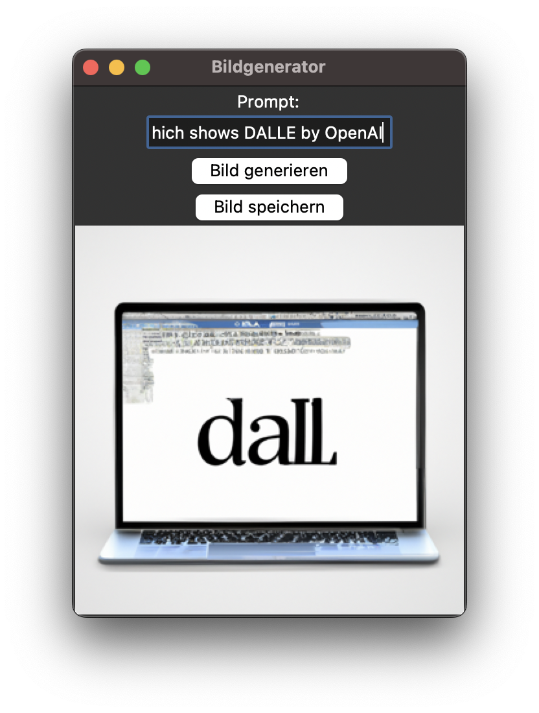

# OpenAI DALLE GUI  🖥️

A simple UI which can be used to query the OpenAI API DALLE endpoint and save the result

# Usage 💪🏼
1. Install the requirements (preferably in a virtual environment) using `pip install -r requirements.txt`
2. Create a .env file containing
```
OPENAI_KEY="sk-...YOUR OPENAI KEY..."
```
3. Run `python main.py`

# Preview 🔎


# Disclaimer 🧑‍⚖️
Created with the help of gpt-3.5 by OpenAI.